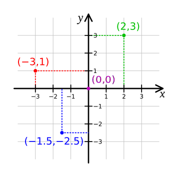

# ¿Qué estudia esta disciplina?

* Análisis y desarrollo de ***algoritmos***

* Representación de problemas e información (estructuras de datos)

* Estudio y desarrollo de modelos de computación, es decir de la maquinaria
  necesaria para computar

* Lenguajes y técnicas de programación

* Áreas prácticas: Gráficos, animación, simulación, redes y telecomunicaciones,
  aprendizaje automático (inteligencia artificial), ingeniería de software, ...

-------------------------------------------------------------------------------

## Problemas fundamentales

 1. ¿Qué tipos de problemas se pueden resolver automáticamente (por una máquina)?

 2. ¿A qué costo se puede resolver un problema (cuántos pasos o cuánta memoria
    requiere)?


-------------------------------------------------------------------------------

## Computación y matemáticas

En computación nos concentramos en cómo computar *mecánicamente* una solución a
un problema, lo que nos lleva a las siguientes preguntas.

1. ¿Cómo debería ser un *dispositivo de cómputo programable* o *computadora*?
2. ¿Cómo se deberían *describir los programas*?

Para la primera pregunta hay muchas alternativas pero nos concentraremos en un
*dispositivo de cómputo general*.

Para la segunda pregunta también hay muchas alternativas, es por eso que existen
muchos *lenguajes de programación*.

A los problemas generalmente los plantearemos como *problemas matemáticos*
usando valores *numéricos*, *conjuntos*, *secuencias*, *tuplas*, *matrices* y otros.

También necesitaremos describir la *manipulación* de esos objetos para construir
soluciones mediante la aplicación de *funciones* y *operadores*.

> Ejemplo: El *valor absoluto de un número es su valor no negativo*
> (independiente de su signo).
> Matemáticamente:
> $$ 
> abs(n) = \mid n\mid =   \left\{
>                           \begin{matrix} 
>                             n  \: si \: n \geq 0 \\
>                             -n \: \textrm{en otro caso}
>                           \end{matrix}
>                         \right.
> $$
> En un programa (en un lenguaje hipotético) se podría definir como:
> ```
> abs(n) = n si n > 0 sino -n
> ```

Como otro ejemplo de representación, un punto en un sistema de coordenadas
cartesianas de dos dimensiones podría hacerse con un par ordenado (o *tupla*) de
la forma $(x,y)$, donde $x$ representa el valor en el eje horizontal o *abscisa*
e $y$ el valor en el eje vertical u *ordenada*.



> Los lenguajes de programación nos permiten definir y manipular datos como los
> mencionados. En algunos casos con diferentes notaciones.

----------------------------------------------------------------------------

## Resolución de problemas mediante algoritmos

En matemáticas un problema o concepto comúnmente se describe mediante una
definición.

> *Problema*: Una raíz de una función $f$ es un valor $x$ tal que $f(x)=0$.
> 
> Ejemplo: El valor $x=0.5$ es la raíz de la función $f(x)=2x-1$, como se puede
> apreciar en el gráfico de abajo.


La frase anterior define *qué es* una raíz pero no especifica *cómo* la podemos
encontrar.

El álgebra nos permite encontrar una solución mediante su *manipulación
simbólica* aplicando propiedades de la aritmética.

> Buscamos un valor $x$ tal que $2x-1=0$, entonces, $2x=1$, finalmente
> $x=\frac{1}{2}=0.5$.

Un enfoque *computacional* es escribir un *programa* que *busque* la solución.
Un programa posible (para funciones crecientes) se muestra abajo y se basa en la
estrategia de ir achicando el intervalo en que se encontrará la raíz.

Dado un intervalo $[a, b]$ en el que puede estar la raíz $f$.

1. Determinar el punto medio del intervalo: $x = (a + b) / 2$
2. Si $abs(f(x))<0.001$, la raíz es $x$, fin del programa. Sino, seguimos
3. Si $f(x)<0$, $a = x$, sino $b = x$
4. Volver al paso 1

Ejecutemos el programa con el intervalo inicial $[a=-1, b=1]$.

> 1. Paso 1: $x = (-1 + 1) / 2 = 0$
> 2. Paso 2: $abs(f(0))=1$. Debemos continuar
> 3. Paso 3: Como $f(0)=-1<0$, el nuevo intervalo es $[a=x=0, b=1]$
> 4. Paso 4: Volvemos al paso 1 del algoritmo
> 5. Paso 1: $x = (0 + 1) / 2 = \frac{1}{2} = 0.5$
> 6. Paso 2: Ahora $abs(f(0.5)) = 0 < 0.001$, la raíz es $x=0.5$

> [!WARNING|label:Preguntas]
> 1. ¿Cuántos pasos haríamos si el intervalo inicial fuera $[0, 1]$?
> 2. ¿Qué sucede con el programa dado si damos un intervalo que no contiene la
>    raíz?

----------------------------------------------------------------------------

## Algoritmos

> [!Note|label:Definición]
> Un *algoritmo* es un programa que siempre termina.

El programa dado arriba no es un *algoritmo* (*¿por qué?*). Sin embargo con una
pequeña modificación en el paso 1 podríamos convertirlo en algoritmo.

Debemos notar que en cada ciclo (repetición de los pasos 1- 3) vamos achicando
el intervalo. Una forma de finalizar el programa es terminarlo si el intervalo
es *considerablemente pequeño*.

> ¿Te animas a proponer tal modificación?

----------------------------------------------------------------------------

## Lenguajes de programación

Si bien podemos describir programas en *lenguaje natural* como lo hemos hecho,
para programar una computadora real debemos expresar un programa en un *lenguaje
formal*, es decir con estructuras sintácticas muy específicas.

Un lenguaje de programación define la *sintaxis* y el *significado (semántica)*
de sus frases.

Existen muchísimos lenguajes de programación, cada uno con características
particulares. Algunos lenguajes están diseñados para resolver ciertos tipos de
problemas de manera más natural que otros.

Los lenguajes de programación también definen *abstracciones* sobre la
definición y manipulación de datos, como también el *flujo de control* de los
pasos de un programa, como selección (*si-sino*) y repetición.

> Cuando escribimos el texto de un programa en un lenguaje éste debe ser
> *convertido* al *lenguaje de máquina*, es decir a las instrucciones concretas del
> tipo de computadora que usemos.
> 
> Esta conversión o *traducción* se hace con otros programas específicos a cada
> lenguaje. Estos programas se conocen como *compiladores* o *intérpretes*.

----------------------------------------------------------------------------

## Abstracción y descomposición de problemas

La tarea de *abstraer* un problema, concepto o sistema consiste en descartar
detalles y extraer los aspectos mas importantes para su análisis.

Como vimos, los lenguajes de programación nos permiten abstraernos de los
detalles de la máquina concreta. No necesitamos conocer los detalles de las
instrucciones de máquina.

Para resolver un problema comúnmente se usa una estrategia de *descomposición*
en problemas mas simples para luego combinarlos en la solución final.

Por ejemplo, en el programa de arriba, podríamos dejar el problema de calcular
el valor absoluto (función `abs(v)`) para más tarde, asumiendo que será un
problema más simple.

Los lenguajes de programación nos permiten definir *mini-programas*, comúnmente
*funciones* a los cuales les podemos dar un nombre (como `abs`). Esas funciones
luego pueden ser *reutilizadas* en otros programas.

Generalmente la tarea de un buen programador es *definir componentes (ej:
funciones) reusables*.

----------------------------------------------------------------------------

## Computadora

El ser humano se caracteriza por inventar herramientas. La mayoría de ellas se
diseñan con propósitos específicos, es decir resolver un determinado tipo de
problema.

Si bien existen *máquinas programables* como un torno mecánico o una impresora
3d, no necesariamente son *computadoras*.

> [!Note|label:Computadora]
> Máquina programable capaz de resolver la familia de *funciones computables*.
> Una función es computable si existe un algoritmo que compute sus valores.
> Se ha demostrado que hay funciones que no son computables, como verán mas
> adelante en la carrera.

Las computadoras modernas permiten almacenar los datos y las instrucciones de un
programa en su *memoria* y una *unidad central de procesamiento (cpu)* se
encarga de ejecutar las instrucciones en secuencia.

----------------------------------------------------------------------------

## Áreas de la computación

- Teoría: Computabilidad, complejidad comutacional, ...
- Programación: resolución de problemas mediante algoritmos
- Manejo de grandes volúmenes de datos
- Comunicaciones y redes
- Sistemas operativos y software de base
- Análisis, diseño e implementación de lenguajes de programación
- Ingeniería de software (sistemas de gran tamaño, ...)
- Computación científica: Aplicaciones en biología, química, medicina, etc
- Simulación y control: Entrenamiento, conducción autónoma, ...
- Otros...

----------------------------------------------------------------------------

## Tecnología: Computadoras digitales

La siguiente figura muestra la arquitectura de una computadora digital.


Cuando calculamos manualmente usamos papel y lápiz para ir *anotando* o
*recordando* valores y resultados intermedios. En una computadora, el papel es
la *memoria*. En la memoria también se almacenan las instrucciones del programa
a ajecutar.

La *CPU* se encarga de ir leyendo cada instrucción del programa desde la
memoria y ejecutarla. Comúnmente hay distintos tipos de instrucciones:

- Lectura/escritura de un valor en la CPU desde/hacia la memoria.
- Operaciones aritméticas: $+, -, \times, /, \ldots$
- Operaciones lógicas: $\lt, \gt, =, \neq, \leq, \geq, \ldots$
- Otras como *saltar a otra instrucción*, *saltar si una condición es verdadera*, ...

Debemos notar que comúnmente los algoritmos consisten en una secuencia de
instrucciones con cálculos, decisiones lógicas y repeticiones.

Los dispositivos de entrada-salida permiten que la computadora interactúe con el
mundo exterior. Algunos dispositivos comunes son: teclados, mouse, pantallas,
discos (almacenamiento), cámaras de video, micrófonos, parlantes, etc.

> [!NOTE|label:Nota]
> ¿Por qué *digitales*? Porque están formados por *circuitos lógicos (o, y, no,
> ...)* y almacenan y procesan datos numéricos. La memoria contiene sólo
> números, comúnmente representados en binario. Un dígito binario o *bit* es un
> valor de $\{0,1\}$.

<iframe width="530" height="315" 
src="https://www.youtube.com/embed/icrl3U0IVqw?si=qhdyxsDjpU8fuGQc" 
title="El sistema binario" frameborder="0" 
allow="accelerometer; autoplay; clipboard-write; encrypted-media; gyroscope; picture-in-picture; web-share" allowfullscreen></iframe>

En realidad el sistema binario se basa en los *sistemas numericos posicionales*,
como el decimal.

Estos sistemas se basan en un conjunto de cifras que conforman su *base*. En
decimal, las cifras son el conjunto $\{0,1,2,3,4,5,6,7,8,9\}$.

El valor de un número está dado por 
  
$$d_{n-1} d_{n-2} \ldots d_0 = \sum_{i=0}^{n-1} d_i^{b^i} $$

Ejemplos: 

1. En decimal, la base $b=10$, los dígitos, $\{0,1,2,3,4,5,6,7,8,9\}$

   $$4531 = 1 \times 10^0 + 3 \times 10^1 + 5 \times 10^2 + 4 \times 10^3$$

   ($4531 = 1 + 30 + 500 + 4000$)

2. En binario, la base $b=2$ y las cifras, el conjunto $\{0,1\}$

   $$(1101)_2 = 1 \times 2^0 + 0 \times 2^1 + 1 \times 2^2 + 1 \times 2^3 = (13)_10$$

   (el 1101 en binario equivale al 13 en decimal)

> [!NOTE|label:Pregunta]
> ¿Por qué en *binario*? Porque es más simple diseñar un *bit* ya que tiene sólo
> dos posibles estados o valores. Representar una cifra decimal requiere 10
> estados posibles, lo cual requiere de dispositivos mucho más complejos.

Mas adelante veremos cómo es posible representar con simples bits números
enteros, aproximaciones de reales, vectores y matrices, imágenes, sonido, etc.

También veremos que podremos hacer animaciones mostrando en forma repetitiva
diferentes imágenes en la pantalla. Nuestro cerebro interpreta esa sucesión de
imágenes mostradas rápidamente como algo en movimiento.
